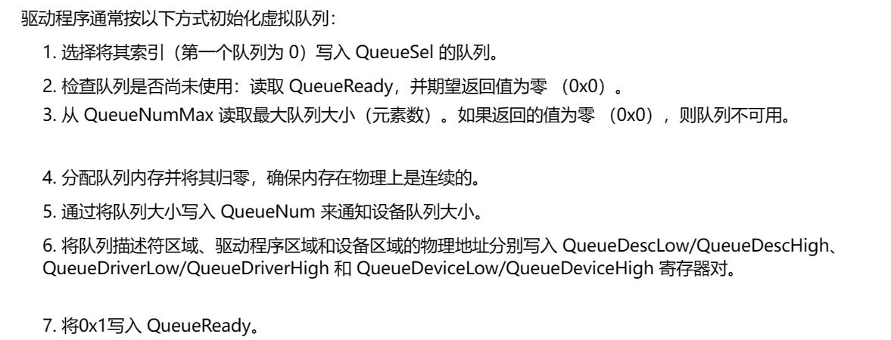

wusskk
xv6是如何确定virtio-blk设备内存映射的地址的

GitHub Copilot
在 xv6 中，Virtio 设备的内存映射地址是硬编码的。在你给出的 virtio_disk.c 文件中，你可以看到以下的代码：

这里的 VIRTIO0 是 Virtio 设备的内存映射地址，它在 memlayout.h 文件中定义：

这个地址是由 QEMU 的 Virtio 设备模型决定的。在 QEMU 中，Virtio 设备默认的内存映射地址是 0x10001000。因此，xv6 直接使用这个地址来访问 Virtio 设备的寄存器。

请注意，这种硬编码的方式只适用于简单的系统，如教学用的 xv6。在实际的操作系统中，设备的内存映射地址通常是通过设备树或 ACPI 表等机制动态获取的。

wusskk
qemu有多个virtio设备加载，那么默认的内存映射地址如何确定？

GitHub Copilot
在 QEMU 中，多个 Virtio 设备的内存映射地址是通过设备的 bus 参数来确定的。在你给出的命令行参数中，你可以看到以下的部分：

这里的 bus=virtio-mmio-bus.0 参数指定了这个设备连接到的总线。在 QEMU 中，每个 Virtio MMIO 总线都有一个基地址，设备的内存映射地址是在这个基地址上加上设备的偏移量。偏移量是根据设备在总线上的顺序来确定的，第一个设备的偏移量是 0，第二个设备的偏移量是 0x200，第三个设备的偏移量是 0x400，以此类推。

例如，如果你有两个 Virtio 设备连接到 virtio-mmio-bus.0，那么第一个设备的内存映射地址就是 VIRTIO0（即 0x10001000），第二个设备的内存映射地址就是 VIRTIO0 + 0x200（即 0x10001200）。

请注意，这种方式只适用于 QEMU 的 Virtio MMIO 设备模型。其他类型的设备或其他的模拟器可能有不同的方式来确定设备的内存映射地址。

## 驱动初始化

1. 检查mmio映射地址是否是virtio-net设备
2. 重置设备
3. status字段设置acknowledge位，表明guest系统已注意到设备
4. status字段设置driver位，表明guest系统已知道如何驱动设备
5. 协商features
6. 设置FEATURES_OK状态位。在此步骤之后，驱动程序不得接受新功能位。
7. 重新读取设备状态以确保FEATURES_OK位仍处于设置状态：否则，设备不支持我们的功能子集，设备无法使用。
8. 执行特定于设备的设置，包括发现设备的 virtqueue、可选的每总线设置、读取和可能写入设备的 virtio 配置空间以及 virtqueue 的填充。

9. 设置DRIVER_OK状态位。此时，设备处于“活动状态”。